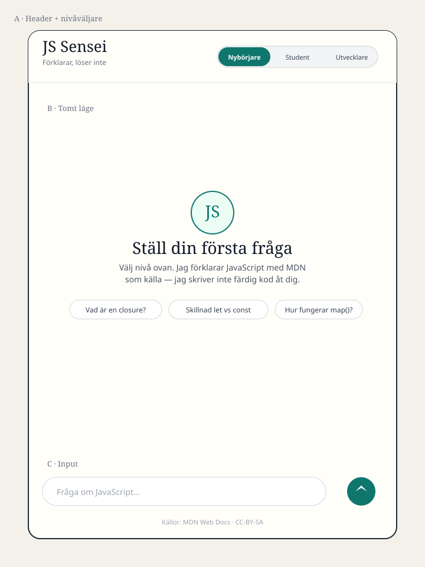
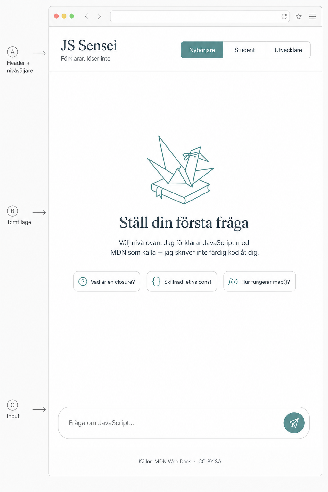
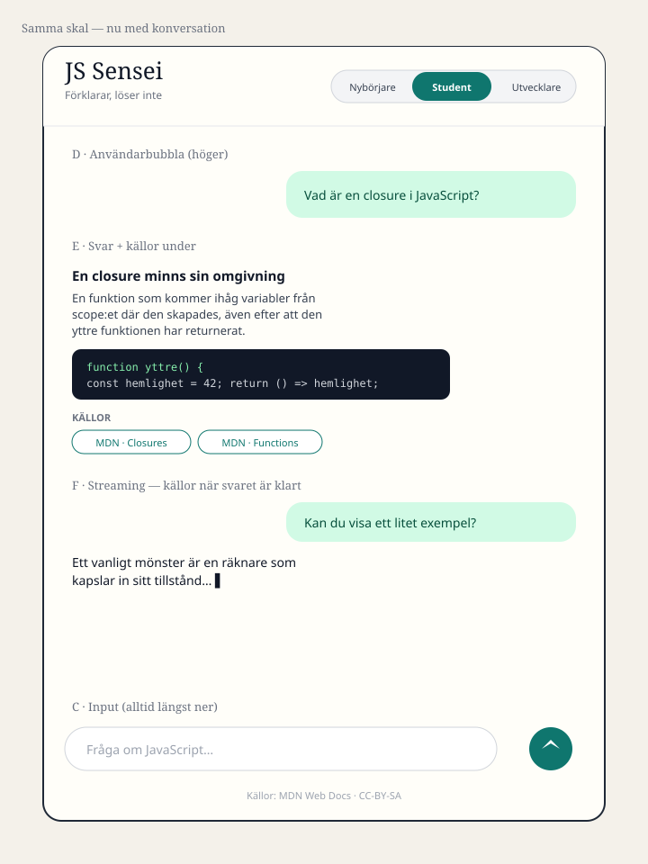
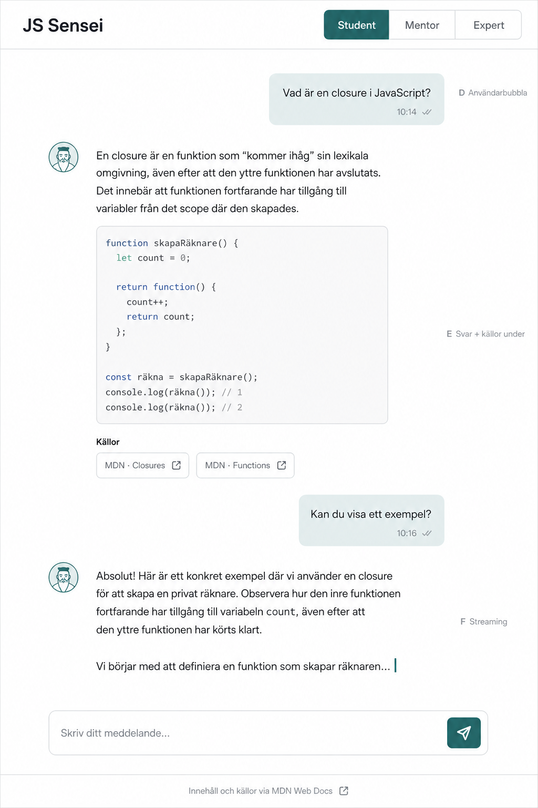

# UI-skiss — JS Sensei

Wave 0 / issue #10. Skissen är avtalet för #11 och #12. PNG:erna är
stämning; SVG + besluten nedan är sanningen (PNG-text kan vara suddig).

## Skisser

### Tomt läge



Visuell riktning:



### Chatt med källor och streaming



Visuell riktning:



## Layout (tre zoner, ingen sidebar)

```
┌──────────────────────────────────────────────┐
│  JS Sensei          [Nybörjare|Student|Dev]  │  A  header, alltid synlig
├──────────────────────────────────────────────┤
│                                              │
│   tomt-läge  ELLER  meddelandelista          │  B  scrollar
│                                              │
├──────────────────────────────────────────────┤
│  [ Fråga om JavaScript…               ] (➤)  │  C  fast i botten
│  Källor: MDN Web Docs · CC-BY-SA             │
└──────────────────────────────────────────────┘
```

En kolumn, maxbredd ~42rem, centrerad. Det räcker för MVP-resan:
öppna → välj nivå → fråga → läs svar + källor.

## Designbeslut

| # | Beslut | Varför |
|---|---|---|
| 1 | Nivåväljare i headern, inte i input eller en settings-meny | Måste synas före första frågan (#11/#12). Segmented control: Nybörjare / Student / Utvecklare. |
| 2 | Tomt läge med rubriken **Ställ din första fråga** | Issuens krav. En mening om "förklarar, löser inte" så produktidén syns innan chatten startat. |
| 3 | Tre förslagschips i tomt läge | Fyller inputen vid klick. Wave 0: statiska strängar, inget extra API. |
| 4 | Användare höger, assistent vänster | Assistenten är ett undervisningskort, inte en tjock chattbubbla. |
| 5 | Källor som chips **under** färdigt assistantsvar | En rad `Källor` + MDN-länkar. Inga källor medan svaret streamar. |
| 6 | Input fast i botten | Placeholder: `Fråga om JavaScript…`. |
| 7 | Ljust tema, en accent (teal `#0F766E`) | Wave 0 ska inte poleras. Mörkt tema = wave 2–3 om det behövs. |
| 8 | Svenska i UI:t | Appen undervisar på svenska; kodexempel får vara engelska. |
| 9 | MDN-attribution i footern | CC-BY-SA, redan beslutat i PLAN.md. |
| 10 | Ingen sidebar, historik, röst eller inställningar | Stretch / senare waves. |

## Copy (kanonisk)

- Wordmark: `JS Sensei`
- Tagline: `Förklarar, löser inte`
- Tomt-läge, rubrik: `Ställ din första fråga`
- Tomt-läge, brödtext: `Välj nivå ovan. Jag förklarar JavaScript med MDN som källa — jag skriver inte färdig kod åt dig.`
- Chips: `Vad är en closure?` · `Skillnad let vs const` · `Hur fungerar map()?`
- Input-placeholder: `Fråga om JavaScript…`
- Källrad: `Källor`
- Footer: `Källor: MDN Web Docs · CC-BY-SA`

## Vad #11 och #12 ska bygga (inte den här issuen)

- **#11** — de tre zonerna, `useChat` mot `/api/chat`, streamad text, källchips under svar. Följ Fastuos kontrakt i `docs/api-contract.md` när den finns.
- **#12** — nivåväljaren skickar `level` i request-body. Default: `nybörjare` (första segmentet).

## Inte i den här skissen

Kod, CSS-tokens i appen, mörkt tema, röst, trådar, markdown-polish.
Det är wave 1–3.
